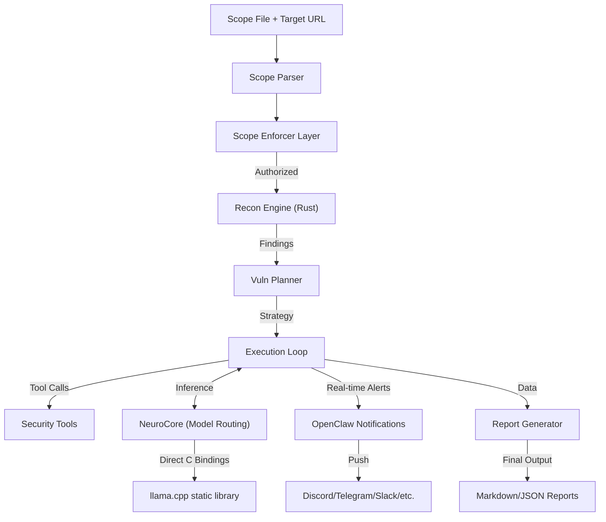

# 🧠 NeuroRift: Terminal-Based Multi-Agent Intelligence System

[](LICENSE)
[](https://www.python.org/)
[](https://github.com/demonking369/NeuroRift)
[](https://github.com/demonking369/NeuroRift)

> **"Intelligence amplified through orchestrated AI agents."**

**Designed and developed by demonking369**

> [!IMPORTANT]
> **🚧 THIS PROJECT IS CURRENTLY IN ACTIVE DEVELOPMENT (BETA Phase) 🚧**
>
> While the core features are functional, you may encounter bugs or incomplete features. We are actively shaping the future of this tool.

---

## 📖 Table of Contents
- [Overview](#-overview)
- [Architecture](#-architecture)
- [Key Features](#-key-features)
- [Installation Guide](#-installation-guide)
- [Usage Manual](#-usage-manual)
- [Configuration](#-configuration)
- [Credits & Thanks](#-credits--thanks)
- [Disclaimer](#-legal-disclaimer)

---

## 🔭 Overview

**NeuroRift** is a terminal-based multi-agent intelligence system designed for authorized security research and penetration testing. The framework employs specialized AI agents that work in concert to plan, execute, analyze, and report on security operations with unprecedented precision.

Unlike traditional security tools, NeuroRift leverages **NeuroCore**, a high-performance, embedded inference engine that replaces external LLM servers with direct **llama.cpp** C bindings. It features a **Scope-File driven autonomous pipeline** that ensures all operations stay within authorized boundaries while maximizing cognitive throughput.

Specialized AI Agent Roles:
- **NR Planner**: Strategic planning and task decomposition
- **NR Operator**: Terminal-based execution with human-in-the-loop controls
- **NR Analyst**: Advanced vulnerability analysis with CVSS scoring
- **NR Scribe**: Professional multi-format report generation

The framework unifies industry-standard tools (`nmap`, `nuclei`, `subfinder`) into a cohesive, modular platform accessible via a modern Web Dashboard or a powerful Command Line Interface (CLI).

---

## 🏗️ Architecture

NeuroRift is built on a multi-agent orchestration architecture with strict operational discipline:



---

## 🚀 Key Features

### 1. **NeuroCore Inference Engine**
*   **Direct C Bindings**: Embedded runtime using `llama.cpp` static library for zero HTTP overhead.
*   **VRAM-Aware Loading**: Real-time VRAM monitoring ensures models are only loaded when needed and unloaded immediately after task completion.
*   **Multi-Model Task Routing**: Dynamically routes tasks to specialized models:
    - **vuln_planning** → `hermes-2-pro`
    - **exploit_generation** → `deepseek-coder`
    - **recon_analysis** → `mistral-instruct`
    - **context_compression** → `phi-3-mini`
*   **CPU Fallback**: High-performance execution even on hardware without dedicated GPUs.

### 2. **Real-Time Notifications (OpenClaw)**
*   **Multi-Platform Support**: Sends live updates to Discord, Telegram, Slack, WhatsApp, Signal, Matrix, and 20+ other platforms.
*   **Configurable Alerts**: Complete control via `notifications.yaml` for event toggles (scan_started, vuln_found, etc.).
*   **Severity Filtering**: Adjust notifications based on risk levels (low | medium | high | critical).
*   **Instant Critical Alerts**: Critical findings always trigger immediate push notifications regardless of filters.

### 3. **Multi-Agent Orchestration**
*   **NR Planner**: Creates strategic execution plans with task decomposition and risk assessment.
*   **NR Operator**: Executes commands with human-in-the-loop controls.
*   **NR Analyst**: Performs advanced vulnerability analysis with CVSS 3.1 scoring.
*   **NR Scribe**: Generates professional reports in multiple formats.

### 4. **Advanced Reconnaissance Engine**
*   **Rust-Powered**: Dedicated high-performance networking core for subdomain enumeration, port scanning, and probing.
*   **Vulnerability Assessment**: Integrated `nuclei` scanning for rapid identification of security flaws.

### 5. **Human-in-the-Loop Controls**
*   **Required Approval**: High-risk commands and external API calls require researchers' explicit consent.
*   **Audit Trail**: Complete logging of all planning decisions and execution outcomes.

---

## 📦 Installation Guide

### **Prerequisites**
*   **Operating System**: Linux (Kali Linux or Ubuntu 22.04+ recommended)
*   **Python**: Version 3.10 or higher
*   **Node.js & npm**: Required for Web Mode and OpenClaw
*   **Rust**: Required for Recon Engine components

### **Step-by-Step Setup**

1.  **Clone the Repository**
    ```bash
    git clone https://github.com/demonking369/NeuroRift.git
    cd NeuroRift
    ```

2.  **Run the Unified Installer**
    ```bash
    # Handles Rust, Python, and Node.js dependencies
    bash install_script.sh
    ```

3.  **NeuroCore Model Setup**
    ```bash
    source .venv/bin/activate
    python -m neurocore.cli setup
    ```

4.  **OpenClaw Onboarding (Notifications)**
    ```bash
    npm install -g openclaw@latest
    openclaw onboard --install-daemon
    ```

---

## 🎯 Usage Manual

### **Mode A: Web Dashboard (Recommended)**
```bash
# Standard Launch
neurorift --webmod
```
*   **Access**: Open your browser to `http://localhost:3000`
*   **System State**: Real-time monitoring of NeuroCore model status and pipeline progress.

### **Mode B: CLI Intelligence Mode (Orchestrated)**
```bash
# Start an autonomous assessment
neurorift -t example.com --scope my_scope.txt --orchestrated
```

---

## 🔧 Configuration

NeuroRift configuration is managed via specialized YAML files:

- **`config/models.yaml`**: Controls NeuroCore model paths, roles, and VRAM limits.
- **`config/notifications.yaml`**: Configuration for messaging channels and severity filters.
- **`configs/neurorift_config.json`**: Core engine parameters.

| Variable | Description | Default |
| :--- | :--- | :--- |
| `NEUROCORE_MODEL` | Primary LLM for Orchestrated Pipeline | `hermes-2-pro` |
| `NEUROCORE_MODELS_PATH` | Path to your local GGUF model storage | `~/neurocore/models/` |
| `AI_ENABLED` | Master switch for AI components | `true` |

---

## ⚠️ Legal Disclaimer

**NeuroRift is purpose-built for AUTHORIZED security testing, red teaming, and educational research.**
*   **Authorization Required**: You must have explicit, written permission from the owner of any system you test.
*   **Liability**: The developer is not liable for any misuse or damage.

---

## 🎖️ Credits & Thanks

**NeuroRift is independently developed by demonking369.**

### Core Dependencies
- **NeuroCore** — Custom high-performance LLM runtime (demonking369)
- **OpenClaw** — Unified notification and approval layer
- **[llama.cpp](https://github.com/ggerganov/llama-cpp)** — Static library for C bindings
- **[ProjectDiscovery](https://projectdiscovery.io)** — Security tools (subfinder, nuclei, httpx)
- **[Next.js](https://nextjs.org)** — Web Mode dashboard framework
- **[Nmap](https://nmap.org)** — Network scanning core

> **Thanks to the open-source projects that inspired and supported NeuroRift.**

---

**Designed and developed with ❤️ and ☕ by demonking369**
